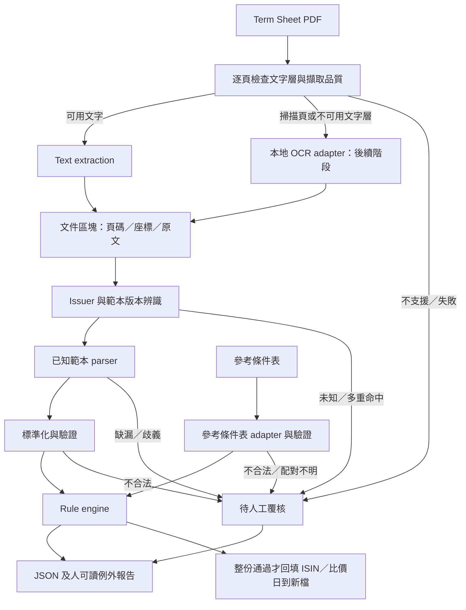

# 架構概覽

## 目標與範圍

協助作業人員將 FCN Term Sheet 與已確認的下單資料逐欄比對，輸出可回溯到原文件的例外清單。第一階段先支援一家 issuer 的一個文字型 PDF 範本；不做產品定價、交易執行、法律條款解釋或無人覆核的交易放行。

已實作 BARC／HSBC 文字型 PDF 的核對（Issue #7、#9、#41），以參考條件表批量核對多份說明書並回填 ISIN 與比價日（Issue #43、#46，[ADR 0004](adr/0004-reference-sheet-as-check-source.md)）；OCR 與更多範本仍為目標設計。名詞見 [CONTEXT.md](../CONTEXT.md)。

## 系統資料流

OCR 尚未實作時，掃描頁直接回報不支援並要求覆核。混合型 PDF 逐頁處理，不因某頁有文字就跳過其他頁。LLM 不在第一版執行路徑內。

## 建議模組邊界

第一階段實際模組如下（OCR adapter 尚未建立）。

| 預定路徑 | 職責 | 邊界 |
|---|---|---|
| `src/fcn_checker/ingestion.py` | 文件 hash、加密／破損檢查；輸入錯誤轉 ERROR 結果、報告用檔案資訊 | 不解析金融欄位；不嘗試繞過密碼 |
| `src/fcn_checker/extraction.py` | PyMuPDF 逐頁文字行、頁碼、bbox；排除頁碼雜訊 | 輸出頁碼、座標、文字；不判斷核對結果 |
| `src/fcn_checker/issuers.py` | 上手註冊表：每家上手只提供識別資料（代號、範本、名稱、parser 版本、未涵蓋清單）、辨識 `detect`、讀出 `read`（標準欄位＋上手專屬資料）、說明書內部規則 `rules`（[ADR 0005](adr/0005-issuer-adapter-and-shared-rules.md)）；範本辨識 `detect` 零個或多個命中轉人工覆核 | 批量入口、CLI、PANEL 都由此分派；新增上手在此登記，並在 `config/issuer_prefixes.toml` 登記上手編號 |
| `src/fcn_checker/parsers/` | `layout.py` 章／條／子項定位（格式由各上手的 `LayoutSpec` 提供）；`barc.py` 範本辨識與欄位、價格表擷取；`barc_schedule.py` §13 配息表與提前出場表；`hsbc.py`／`hsbc_tables.py` HSBC 專屬欄位與表格 | 使用錨點、座標與有限 regex；多重命中轉歧義，不任選 |
| `src/fcn_checker/schema.py` | 標準化型別：`ParsedField`、`Evidence`、`CheckResult`、`CheckReport` | 缺值／歧義／不合法／不適用分開；保留來源證據；不依賴其他模組 |
| `src/fcn_checker/standard_fields.py` | 說明書標準欄位清單（`STANDARD_FIELDS`）、讀出結果介面 `TermSheet` 與值的形狀（`PriceRow`、`AutocallSchedule`、審查標準規則的出處清單 `Occurrence`） | 上手 parser 與共用規則之間的 seam：各上手 parser 依此交出欄位，共用規則只讀這些欄位 |
| `src/fcn_checker/config.py` | 載入審查標準、參考條件表格式、上手編號對照（TOML）；根目錄設定缺檔時改用程式內建設定 | 會隨時間改變的基準只在設定檔 |
| `src/fcn_checker/orders/reference.py` | 參考條件表 adapter（多列表格，所有上手共用，記下每欄儲存格位置供回填）與 `OrderRecord` | 未知欄名回報覆核；禁止用文件值填補預期值 |
| `src/fcn_checker/rules/` | 版本化規則（rule_id）與明確容差；`reference.py` 為參考條件表共用規則（表上事先填好的欄位與標準欄位的比對、Non-Call；空值寫法取自格式設定）；`common.py` 共用工具、參考條件表欄名檢查與審查標準規則（`review_standard_rules`）；`barc.py`、`hsbc.py` 等為上手專屬的說明書內部規則與未涵蓋清單 | 不讀檔、不呼叫模型、不自動修改來源值 |
| `src/fcn_checker/backfill.py` | 回填欄位（ISIN Code、發行日、比價日_1～12）整段流程：每格決策與 `backfill.*` 規則（缺欄名轉人工覆核）、只有整份 PASS 才寫入、開檔前比對核對時記錄的參考條件表 hash、寫新檔（沿用日期格式、不覆蓋）、決策的顯示標籤 `BackfillAction.label`（報告與 PANEL 共用） | 批量入口 `save_batch` 呼叫；原檔不動 |
| `src/fcn_checker/single_check.py` | 單份核對：配對結果 → 表頭欄位檢查 → 參考條件表欄位規則 → 上手說明書內部規則 → 審查標準規則 → Non-Call／ISIN／發行日／比價日 → 回填決策 → 整體狀態 | 所有上手共用同一順序；只用批量入口交來的讀出結果，不重新辨識或讀出 |
| `src/fcn_checker/reporting.py` | JSON 與 Markdown 報告 | 問題項目優先；呈現差異、證據、未涵蓋規則 |
| `src/fcn_checker/batch.py` | 批量入口，分三段：`preview_batch`（唯讀辨識：檔名上手編號、範本辨識、商品代號、對到的列）、`check_batch`（先辨識全部說明書、讀出一次，同一批多份對到同一列的全部轉人工覆核，其餘配對後交單份核對，不寫檔）、`save_batch`（寫報告、回填新檔與「核對結果」工作表；整份 PASS 才回填）；`run_batch` = 核對＋儲存 | 測試切點 1；單份失敗不中斷整批；原檔不動、不覆蓋既有檔案 |
| `src/fcn_checker/cli.py` | `fcn-batch` 指令與結束碼 | 測試切點 2；無 Web UI、資料庫或雲端服務 |
| `src/fcn_checker/panel_workflow.py` | PANEL 工作階段：參考條件表＋多份說明書的預覽、核對、儲存，以及來源與設定檔 hash 失效檢查 | 測試切點 3；呼叫批量入口三段，按儲存才寫檔 |
| `src/fcn_checker/panel.py` | Tkinter 本機視窗：選檔（參考條件表＋多份 PDF）、預覽表、逐份結果與回填決策呈現 | 背景讀檔、主執行緒更新 UI；Windows 啟動前設定 system DPI awareness；不建立網路服務；仍接受舊啟動器的 `--order-formats-dir` |
| `src/fcn_checker/updating.py` | 公開 GitHub main 更新、隔離安裝與原子切換 | `PanelUpdater` 公開測試入口；不讀取或上傳交易資料，不覆寫本機 config |
| `panel_bootstrap.py` | 穩定的本機更新版本啟動器 | 限定版本資料夾；不連網，維持根目錄 config |
| `tests/synth.py`、`tests/hsbc_synth.py` | 各上手的說明書合成器：產生合成說明書 PDF 與一致的參考條件表列 | 數值皆虛構；不提交真實客戶交易資料；上手之間互不引用 |
| `tests/pdf_writer.py`、`tests/reference_synth.py`、`tests/harness.py` | 不分上手的測試工具：PDF 寫入、參考條件表合成（發行機構寫法取自格式設定）、單份核對 harness（經 `check_batch`，依 rule_id 取結果） | 新測試用共用 harness 寫 |

PyMuPDF 優先用於文字區塊與座標擷取，pdfplumber 用於表格／版面需要；實際採用順序應由樣本與授權條件評估，首版不必同時依賴兩者。純文字攤平可能破壞欄位關係，應保留列、區塊及跨頁資訊。OCR adapter 待文字流程穩定後加入，不預先綁定引擎。

## 資料與判定

詳見 [資料契約](data-contract.md)。文件及下單資料各自驗證後，依明確交易識別配對；第一個流程可用人工指定的一對檔案，不用相似度猜配對。

每項規則產生 `PASS`、`MISMATCH`、`REVIEW_REQUIRED`、`NOT_APPLICABLE` 或 `ERROR`。只有所有適用必核欄位有可靠值且通過驗證／核對，整體才可為 `PASS`；未實作的必核規則不算通過。整體狀態優先順序為 `ERROR > REVIEW_REQUIRED > MISMATCH > PASS`，報告仍保留全部差異。`NOT_APPLICABLE` 必須由產品範本與明確規則支持，不能以空值推定。

利率、金額與比例使用 Decimal 概念；序列化為十進位字串，避免二進位浮點誤差。日期不猜日月順序；百分比不混淆年率與每期利率。容差、四捨五入、計息及日期調整規則必須按欄位明定、版本化，預設不使用寬鬆容差。

## 可追溯與部署

首版規劃為本機 Python CLI。執行紀錄包含文件 hash、下單輸入 hash、parser/schema/rule/config 版本、程式 commit、擷取工具版本與執行時間。同輸入與同版本應產生相同的標準化值及判定，時間與 run ID 等 metadata 不列入此保證。

機密輸入與產出只放 `data/`、`runtime/`；console log 以識別碼與錯誤分類為主，詳細證據放受控本地報告。保存期限、存取控制及報告遮蔽在試行前確認。第一版不需 API 金鑰，不會自動載入 `.env`，設定格式在實作時確定。

## 擴充與限制

Issue #13 新增本機 Tkinter PANEL，#14、#15、#17 接上預覽、核對與保存；#46 改為參考條件表＋多份說明書，並刪除 BARC 詢價表流程。唯讀預覽有效後才可核對；每份說明書先確認上手與參考條件表的列，配對失敗的說明書只回報原因、不執行一般條件比對。核對結果先呈現問題，再列通過／不適用項目，保留完整頁碼、原文及參考條件表儲存格；未涵蓋規則獨立列為待處理。

參考條件表、每份 PDF、審查標準與兩個設定檔的 hash 在載入前後、核對前後及結果使用時檢查；任一變更即使預覽與結果失效，儲存前另確認參考條件表與核對時相同。讀檔與失效檢查在背景執行，UI 更新只在主執行緒，核對期間不能重複提交。所有資料仍在本機處理，僅在使用者按儲存後寫入報告與回填新檔，沒有 Web UI、資料庫或雲端服務。報告與新檔一律 exclusive create 禁止覆蓋；逐份回報保存狀態，部分失敗不清除當次結果。舊安裝的根目錄 `config` 沒有 `reference_sheet.toml`／`issuer_prefixes.toml` 時，改用版本資料夾內建的同名設定（ADR 0003 不自動修改根目錄設定）。Windows 透過專案獨立 .venv 安裝與雙擊啟動。

新增 issuer 時加入獨立且版本化的 parser 與對應 fixtures，不把所有文件塞入一組通用 regex。未知格式保留人工覆核入口。步驟、交付物與驗收門檻見[新增上手實作規範](issuer-onboarding.md)；多上手分派已完成（Issue #28）：新上手在 `issuers.py` 登記、在 `config/issuer_prefixes.toml` 登記上手編號後，批量入口、CLI、PANEL 與名稱樣板即依上手運作。上手 adapter 只提供標準欄位與說明書內部規則，參考條件表欄位、審查標準、Non-Call／ISIN／發行日／比價日與回填規則各上手共用（[ADR 0005](adr/0005-issuer-adapter-and-shared-rules.md)）。

未來 LLM fallback 若獲批准，只能作為 extraction adapter 提供候選欄位與來源證據；不得修改預期下單值或取代 rule engine。需另立 ADR、資料傳送政策與驗證門檻；第一版無相關 SDK、開關或外部呼叫。

決策：[0001：第一版採規則式核對](adr/0001-deterministic-runtime.md)、[0002：本機 Python CLI，PDF 擷取採用 PyMuPDF](adr/0002-python-cli-pymupdf.md)、[0004：核對條件統一改用參考條件表](adr/0004-reference-sheet-as-check-source.md)、[0005：上手 adapter 只提供標準欄位與說明書內部規則，參考條件表與審查標準規則各上手共用](adr/0005-issuer-adapter-and-shared-rules.md)。

手動更新決策：[0003：PANEL 以公開 GitHub main 提供手動更新](adr/0003-public-github-panel-update.md)。程式更新與審查設定導入分開；更新成功後重新啟動，未儲存結果不保留，更新前有提示。
