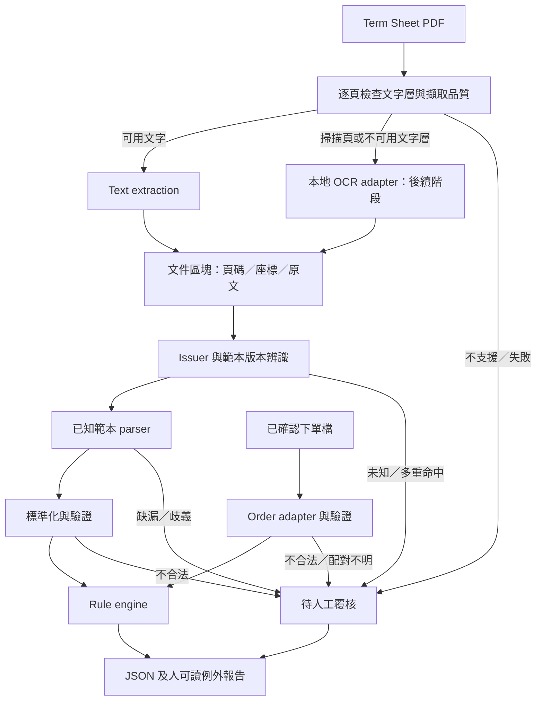

# 架構概覽

## 目標與範圍

協助作業人員將 FCN Term Sheet 與已確認的下單資料逐欄比對，輸出可回溯到原文件的例外清單。第一階段先支援一家 issuer 的一個文字型 PDF 範本；不做產品定價、交易執行、法律條款解釋或無人覆核的交易放行。

本文件描述目標設計；目前尚未建立 runtime 模組。

## 系統資料流

OCR 尚未實作時，掃描頁直接回報不支援並要求覆核。混合型 PDF 逐頁處理，不因某頁有文字就跳過其他頁。LLM 不在第一版執行路徑內。

## 建議模組邊界

以下是未來目錄規劃，不代表已有可 import 的套件。

| 預定路徑 | 職責 | 邊界 |
|---|---|---|
| `src/fcn_checker/ingestion/` | 文件識別、hash、大小／加密／破損檢查 | 不解析金融欄位；不嘗試繞過密碼 |
| `src/fcn_checker/extraction/` | PyMuPDF/pdfplumber 與日後 OCR adapter | 輸出頁碼、座標、文字；不判斷核對結果 |
| `src/fcn_checker/parsers/` | issuer／範本版本偵測、欄位與表格定位 | 使用錨點、座標與有限 regex；多重命中不任選 |
| `src/fcn_checker/schema/` | 標準化型別與欄位驗證 | 缺值／未適用／不合法分開；保留來源證據 |
| `src/fcn_checker/orders/` | 下單 CSV/JSON 等來源映射 | 實際來源待確認；禁止用文件值填補預期值 |
| `src/fcn_checker/rules/` | 版本化規則與明確容差 | 不讀 PDF、不呼叫模型、不自動修改來源值 |
| `src/fcn_checker/reporting/` | JSON 與本地人可讀報告 | 呈現差異、證據、失敗原因及覆核項目 |
| `src/fcn_checker/cli.py` | 本機批次流程與結束狀態 | 第一階段無 Web UI、資料庫或雲端服務 |
| `tests/fixtures/` | 合成／經核准去識別案例 | 不提交真實客戶交易資料 |

PyMuPDF 優先用於文字區塊與座標擷取，pdfplumber 用於表格／版面需要；實際採用順序應由樣本與授權條件評估，首版不必同時依賴兩者。純文字攤平可能破壞欄位關係，應保留列、區塊及跨頁資訊。OCR adapter 待文字流程穩定後加入，不預先綁定引擎。

## 資料與判定

詳見 [資料契約](data-contract.md)。文件及下單資料各自驗證後，依明確交易識別配對；第一個流程可用人工指定的一對檔案，不用相似度猜配對。

每項規則產生 `PASS`、`MISMATCH`、`REVIEW_REQUIRED`、`NOT_APPLICABLE` 或 `ERROR`。只有所有適用必核欄位有可靠值且通過驗證／核對，整體才可為 `PASS`；未實作的必核規則不算通過。整體狀態優先順序為 `ERROR > REVIEW_REQUIRED > MISMATCH > PASS`，報告仍保留全部差異。`NOT_APPLICABLE` 必須由產品範本與明確規則支持，不能以空值推定。

利率、金額與比例使用 Decimal 概念；序列化為十進位字串，避免二進位浮點誤差。日期不猜日月順序；百分比不混淆年率與每期利率。容差、四捨五入、計息及日期調整規則必須按欄位明定、版本化，預設不使用寬鬆容差。

## 可追溯與部署

首版規劃為本機 Python CLI。執行紀錄包含文件 hash、下單輸入 hash、parser/schema/rule/config 版本、程式 commit、擷取工具版本與執行時間。同輸入與同版本應產生相同的標準化值及判定，時間與 run ID 等 metadata 不列入此保證。

機密輸入與產出只放 `data/`、`runtime/`；console log 以識別碼與錯誤分類為主，詳細證據放受控本地報告。保存期限、存取控制及報告遮蔽在試行前確認。第一版不需 API 金鑰，不會自動載入 `.env`，設定格式在實作時確定。

## 擴充與限制

新增 issuer 時加入獨立且版本化的 parser 與對應 fixtures，不把所有文件塞入一組通用 regex。未知格式保留人工覆核入口。

未來 LLM fallback 若獲批准，只能作為 extraction adapter 提供候選欄位與來源證據；不得修改預期下單值或取代 rule engine。需另立 ADR、資料傳送政策與驗證門檻；第一版無相關 SDK、開關或外部呼叫。

決策：[0001：第一版採規則式核對](adr/0001-deterministic-runtime.md)。
