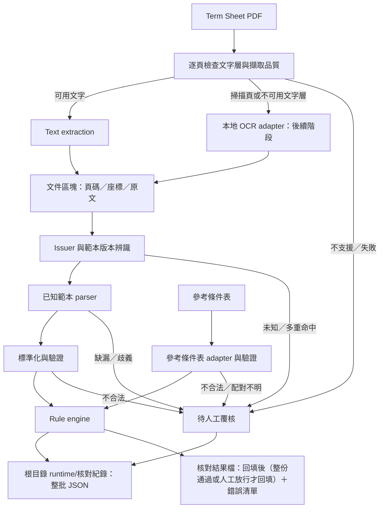

# 架構概覽

## 目標與範圍

協助作業人員將 FCN Term Sheet 與已確認的下單資料逐欄比對，輸出可回溯到原文件的例外清單。第一階段先支援一家 issuer 的一個文字型 PDF 範本；不做產品定價、交易執行、法律條款解釋或無人覆核的交易放行。

已實作 BARC／HSBC／MS 文字型 PDF 的核對（Issue #7、#9、#41、#34、#135、#137），以參考條件表批量核對多份說明書並回填 ISIN 與比價日（Issue #43、#46，[ADR 0004](adr/0004-reference-sheet-as-check-source.md)）；說明書與同商品投資人須知成對核對，兩份都通過或放行才回填（Issue #124，[ADR 0007](adr/0007-iis-paired-with-term-sheet.md)）；OCR 與更多範本仍為目標設計。名詞見 [CONTEXT.md](../CONTEXT.md)。

## 系統資料流

OCR 尚未實作時，掃描頁直接回報不支援並要求覆核。混合型 PDF 逐頁處理，不因某頁有文字就跳過其他頁。LLM 不在第一版執行路徑內。

## 建議模組邊界

第一階段實際模組如下（OCR adapter 尚未建立）。

| 預定路徑 | 職責 | 邊界 |
|---|---|---|
| `src/fcn_checker/ingestion.py` | 文件 hash、加密／破損檢查；輸入錯誤轉 ERROR 結果；來源快照 `SourceSnapshot`（參考條件表、各份說明書與設定檔的路徑和 hash，各在讀取前取一次：設定檔在載入核對設定前、參考條件表與說明書在預覽前；核對紀錄的檔案資訊取自它，`still_valid` 明確重算比對）；輸出檔一律新建 `write_new`（已存在不覆蓋、無法寫入分開回報） | 不解析金融欄位；不嘗試繞過密碼 |
| `src/fcn_checker/extraction.py` | PyMuPDF 逐頁文字行、頁碼、bbox；排除頁碼雜訊 | 輸出頁碼、座標、文字；不判斷核對結果 |
| `src/fcn_checker/issuers.py` | 上手註冊表：每家上手只提供識別資料（代號、範本、名稱、parser 版本、未涵蓋清單）、辨識 `detect`、讀出 `read`（標準欄位＋上手專屬資料）、說明書內部規則 `rules`、規則可讀的參考條件表欄位 `reference_fields`（[ADR 0005](adr/0005-issuer-adapter-and-shared-rules.md)：BARC 宣告年利率與天期、MS 宣告年利率），以及投資人須知範本 `iis`（`IisTemplate`：識別資料、`detect`、`read`、未涵蓋清單、範本專屬規則 `rules`（選填，MS 有）；沒有的上手其投資人須知為未支援上手，ADR 0007）；`detect_iis` 辨識投資人須知範本；範本辨識 `detect` 零個或多個命中轉人工覆核 | 批量入口、CLI、PANEL 都由此分派；新增上手在此登記，並在 `config/issuer_prefixes.toml` 登記上手編號 |
| `src/fcn_checker/parsers/` | `layout.py` 章／條／子項定位（格式由各上手的 `LayoutSpec` 提供）；`barc.py` 範本辨識與欄位、價格表擷取；`barc_schedule.py` §13 配息表與提前出場表；`hsbc.py`／`hsbc_tables.py` HSBC 專屬欄位與表格；`ms.py`／`ms_tables.py`／`ms_scenario.py` MS 範本辨識（新版）、封面項目與各條欄位、日期表／價格表／標的表／費用表、第 18 項情境；`iis.py` 投資人須知讀出結果 `IisSheet`（`f(name)`、全文索引、`provides` 宣告這份範本有的欄位）與共用擷取工具；`barc_iis.py`、`hsbc_iis.py`、`ms_iis.py` 各上手投資人須知的辨識與讀出（BARC 價格表依座標拆欄；MS 只支援新版，提前出場與觸及下限寫法只在「贖回價金之計算」段內判斷） | 使用錨點、座標與有限 regex；多重命中轉歧義，不任選 |
| `src/fcn_checker/schema.py` | 標準化型別：`ParsedField`、`Evidence`、`CheckResult`（必帶項目 `Item`：中文名稱與預期值出處 `ItemSource`，參考條件表出處另記 Excel 欄名）、`CheckReport` | 缺值／歧義／不合法／不適用分開；保留來源證據；不依賴其他模組 |
| `src/fcn_checker/investor_sheet.py` | 投資人須知讀出結果 `IisSheet`（`f(name)`、全文索引、`provides` 宣告這份範本有的欄位）、投資人須知才有的欄位清單 `IIS_FIELDS`、共用規則讀欄位的 `read_iis` | 上手投資人須知 parser 與共用規則之間的 seam（ADR 0007）；範本沒有的欄位不核對，有但讀不到的轉人工覆核 |
| `src/fcn_checker/standard_fields.py` | 說明書標準欄位清單（`STANDARD_FIELDS`）、讀出結果介面 `TermSheet` 與值的形狀（`PriceRow`、`AutocallSchedule`、審查標準規則的出處清單 `Occurrence`） | 上手 parser 與共用規則之間的 seam：各上手 parser 依此交出欄位（含審查標準規則用的欄位），共用規則只經 `read_standard` 讀這些欄位；`TermSheet.f` 不丟例外，沒交出的欄位為 `not_provided` 缺漏；範本沒有的欄位由 adapter 交出 `absent`（不適用），共用規則不核對、不報缺漏 |
| `src/fcn_checker/config.py` | 解析審查標準、參考條件表格式、上手編號對照（TOML）；缺檔或格式錯誤丟出 `IngestionError`（`config_not_found`／`config_invalid`）；審查通過日期為歷次清單，`ReviewStandard.approval_date_on` 依交易日選當天或之前最近一次 | 會隨時間改變的基準只在設定檔 |
| `src/fcn_checker/approval_dates.py` | 維護審查標準的審查通過日期清單（Issue #120）：只能新增晚於最新一筆的日期、修改／刪除最新一筆；寫回時只替換 `approval_dates`、`version`、`effective_date` 三行，先以暫存檔載入驗證再取代原檔 | 只由 PANEL 工作階段呼叫；檔案寫法和預期不同時拒絕自動修改 |
| `src/fcn_checker/check_config.py` | 核對設定 `CheckConfig`：一次載入審查標準、參考條件表格式、上手編號對照與上手註冊表，連同設定檔的路徑、載入前取的 hash（`files`）與版本（`record()` 給核對紀錄）；`with_registry` 換上手註冊表（測試放假上手）。設定檔預設位置（`CONFIG_DIR`、`DEFAULTS`）只在這裡定義；`ConfigPaths.load` 載入，`ConfigPaths.with_fallback` 為 PANEL 的規則（指定的設定資料夾缺參考條件表格式／上手編號對照時改用程式內建設定） | CLI 依參數載入一次、PANEL 每次載入預覽時載入一次，之後只傳這一個值；設定檔有問題在載入時回報 |
| `src/fcn_checker/orders/reference.py` | 參考條件表 adapter（多列表格，所有上手共用，記下每欄儲存格位置供回填）與 `OrderRecord` | 未知欄名回報覆核；禁止用文件值填補預期值 |
| `src/fcn_checker/rules/` | 版本化規則（rule_id）與明確容差；`kit.py` 為規則共用工具（`Context`／`IssuerContext`、產生結果（必給項目）、缺值轉人工覆核、讀參考條件表的值與轉型（參考條件表的值有問題時項目自動是該欄）、`read_standard`）；各規則在建立結果的地方寫項目名稱，兩家上手共用的名稱（價格 `UL_n 執行價`、價格表欄頭百分比）放在 `kit.py`；出處清單型標準欄位的各處名稱由上手 adapter 隨 `Occurrence.name` 交出；`reference.py` 為參考條件表共用規則（表頭欄名檢查、表上事先填好的欄位與標準欄位的比對、Non-Call、期初定價 `field.initial_pricing` 與 `is_vwap`（VWAP 時不比對各標的價格）；空值寫法取自格式設定）；`review_standard.py` 為審查標準規則，進入點為說明書的 `review_standard_rules` 與投資人須知的 `iis_review_standard_rules`（只核對範本有的項目）；`iis.py` 為投資人須知規則（頁數、頁首總頁數、封面商品代號、參考條件表欄位（含 MS 的交易日、期末定價日、KO／KI 條件與月配息率各處）、同商品說明書欄位（含 D 型 KO 觀察起日）；經 `investor_sheet.read_iis` 讀欄位）與上手投資人須知專屬規則的輸入 `IisIssuerContext`；`ms_iis.py` 為 MS 投資人須知專屬規則（商品種類依標的數、開始受理贖回日期 = 說明書）；`derivation.py` 為各上手共用的說明書推算規則（價格推算 `derive.prices`，只讀標準欄位，BARC 語意）；`barc.py`、`hsbc.py`、`ms.py`（＋`ms_scenario.py`）等為上手專屬的說明書內部規則與未涵蓋清單，只拿到 `IssuerContext`。共用規則（`kit`、`reference`、`review_standard`、`derivation`）不依賴 parser 套件；四位小數 `Q4`、兩位小數 `Q2`、下一個平日 `next_weekday`、依顯示位數四捨五入 `shown` 只在 `kit.py`，括號全半形 `full_brackets` 在 `text.py`，說明書多處取值合併在 `ParsedField.from_hits`；上手專屬規則可依賴自己 parser 的專屬資料型別（例：BARC 配息表、HSBC 情境索引） | 不讀檔、不呼叫模型、不自動修改來源值 |
| `src/fcn_checker/backfill.py` | 回填欄位（TS、IIS 打勾、ISIN Code、發行日、比價日_1～12；期初定價 VWAP 時另加各標的價格欄，一律覆寫）整段流程：每格決策與 `backfill.*` 規則（缺欄名轉人工覆核）、寫入呼叫端決定要回填的說明書（整份 PASS 或人工放行）、回填值寫進記憶體中的工作表（沿用日期格式）、決策的顯示標籤 `BackfillAction.label`（PANEL 使用） | 儲存 `saving.save_batch` 呼叫；原檔不動 |
| `src/fcn_checker/result_file.py` | 核對結果檔 `<參考條件表檔名>_核對結果_<時間>.xlsx`：「回填後」（原 `樣本清單` 版面，只留整份通過或人工放行且已回填的列，順序照原表；其他工作表不帶入）與「錯誤清單」（每份沒通過也沒人工放行的 PDF 一列：TDCC Code、PDF 檔名、錯訊；一列怎麼組成只在 `ErrorRow.of` 定義：TDCC Code 取說明書封面商品代號，取不到時用檔名前 12 碼（12 位數字才算）） | 儲存 `saving.save_batch` 呼叫；寫到指定資料夾、exclusive create 不覆蓋 |
| `src/fcn_checker/single_check.py` | 投資人須知另有 `check_investor_sheet(配對結果, PairedIis, 核對設定)`：配對結果 → 投資人須知規則（`rules/iis.py`：頁數、頁首總頁數、封面商品代號、參考條件表欄位、同商品說明書欄位）→ 範本專屬規則（`IisTemplate.rules`，只拿到 `IisIssuerContext`）→ 審查標準規則（`iis_review_standard_rules`，只核對範本有的項目）→ 整體狀態，不回填。單份核對 `check_document(配對結果, 配對, 核對設定)`：配對結果 → 表頭欄位檢查 → 參考條件表欄位規則 → 共用價格推算 → 上手說明書內部規則 → 審查標準規則 → Non-Call／ISIN／發行日／比價日／VWAP 商品的各標的價格 → 回填決策（同時記下回填確定性 `CheckReport.backfill_certain`：有回填決策且回填規則全部通過，人工放行判斷用、不寫進核對紀錄）→ 整體狀態 | 所有上手共用同一順序；只用批量入口交來的讀出結果與下單資料（`Paired`），不重新辨識或讀出；範本 ID 與記錄資料（metadata）由批量入口補上；上手說明書內部規則只拿到 `IssuerContext`（含上手宣告的參考條件表欄位），其餘規則拿完整 `Context` |
| `src/fcn_checker/messages.py` | 錯訊：每條問題的中文說明（`problem_message`），只依核對結果自帶的項目組句：直接比對參考條件表且不一致時寫成「<項目>對不起來：參考條件表 <值>／說明書 <值>」（多格逐格列 Excel 欄名），其他（含由參考條件表推算的值）寫「<項目>：<規則的中文說明>」並附「參考條件表／審查標準／預期」與說明書的值，不比對值的項目只寫說明；規則沒寫說明時依原因與狀態給中文預設 | 核對結果檔「錯誤清單」與 PANEL 結果明細共用；不判定哪一邊錯、不顯示 rule_id／reason_code；不依 rule_id、reason_code 或欄位代碼反推項目 |
| `src/fcn_checker/reporting.py` | 核對紀錄：每次儲存在根目錄（CLI 為執行目錄、PANEL 為安裝根目錄）`runtime/核對紀錄/<時間>.json` 寫一份整批 JSON：程式版本與 commit、設定檔與審查標準的路徑與 hash、參考條件表與每份 PDF 的 hash、每份 PDF 的逐項結果（含項目名稱與出處 `item`；人工放行仍保留原判定，另記 `manual_release`）、證據與回填決策 | 輸入是儲存流程交來的 `BatchRecord`／`RecordItem`，不依賴批量核對結果的型別；供維護人員追查，作業人員不需要看；時間戳與核對結果檔相同、不覆蓋；寫入失敗記在儲存收據，不影響核對結果檔 |
| `src/fcn_checker/batch.py` | 依檔名結尾分文件種類 `DocKind`（`_TS` 說明書、`_IIS` 投資人須知，其他為檔名無法辨識）；同一列配成一組（一份說明書＋一份投資人須知，`BatchItem.partner`），同種多份為多份對到同一列、只有一種為這批缺另一份（都不能放行）；說明書與投資人須知都 fillable 才回填說明書（`BatchItem.fills_sheet`，ADR 0007）。批量入口，分三段，設定都由核對設定傳入：`preview_batch(核對設定, 參考條件表, 說明書)`（讀取前取來源快照（設定檔 hash 取自核對設定），唯讀辨識並讀出：檔名上手編號、範本辨識、商品代號、對到的列；同一批多份對到同一列的全部轉人工覆核；`BatchPreview` 帶著辨識與讀出結果、參考條件表與快照）、`check_batch(預覽)`（先以預覽的快照確認來源仍一致，否則丟出 `source_changed` 要求重新預覽；沿用預覽的讀出，不重新讀 PDF，配對成功的交單份核對，組裝每份的範本 ID 與記錄資料，不寫檔；快照帶在 `BatchOutcome.snapshot`）；儲存在 `saving.py`；每份 PDF 的辨識結果 `Identification`（frozen：文件種類、上手、商品代號、對到的列、唯一的配對問題 `PairingProblem`、規則有沒有跑 `checked`）由辨識階段算出、交給 `BatchItem`，以下判定只看辨識結果與核對報告（整體狀態、回填決策、`CheckReport.backfill_certain`），不回頭翻核對結果的原因碼，放行政策只在 `BatchItem.release_problem` 一處；人工放行在批量核對結果上：`BatchOutcome.release`／`cancel_release` 檢查 `BatchItem.release_problem`（配對乾淨、回填值確定且不和參考條件表打架）後才改變，`released` 唯讀；`BatchOutcome.status` 即時計算；每份的類別 `BatchItem.category`（通過、人工放行、不一致、需人工覆核、未支援上手、執行錯誤）決定狀態標籤（`status_label`：中文狀態；需人工覆核且是配對問題時改寫原因，如「條件表找不到這筆」）、PANEL 標題份數與回填（`fillable`）或列入錯誤清單，錯訊清單 `problem_messages` 由錯誤清單與 PANEL 共用；`BatchOutcome.errors` 只有整批錯誤（設定檔、參考條件表），參考條件表有問題時以 `failed_batch` 回傳 | 測試切點 1；單份失敗不中斷整批；不寫檔 |
| `src/fcn_checker/saving.py` | 儲存：`save_batch(批量核對結果, 輸出資料夾, 根目錄, 時間)` 是唯一的儲存進入點，回傳儲存收據 `SaveReceipt`（核對結果檔、核對紀錄、已回填的說明書 `filled(item)`、寫檔錯誤、含寫檔錯誤的整批狀態）；內部順序只在這裡：確認整份來源快照仍一致 → 開參考條件表 → 依類別決定回填與列入錯誤清單 → 回填 → 核對結果檔 → 核對紀錄；`run_batch(核對設定, 參考條件表, 說明書, 輸出資料夾)` = 預覽＋核對＋儲存（CLI 用，回傳結果與收據） | 測試切點 1；批量核對結果不被儲存改寫，同一份結果可存多次、每次一張收據；來源變更或讀不到時兩個檔都不寫；原檔不動、不覆蓋既有檔案 |
| `src/fcn_checker/cli.py` | `fcn-batch` 指令與結束碼；依參數載入一次核對設定（設定檔有問題時記成整批錯誤，結束碼 2）；已回填、輸出路徑與結束碼依儲存收據 | 測試切點 2；無 Web UI、資料庫或雲端服務 |
| `src/fcn_checker/panel_workflow.py` | PANEL 工作階段：建立時依設定資料夾決定設定檔位置（`ConfigPaths.with_fallback`），每次載入預覽時載入一次核對設定；參考條件表＋多份說明書的預覽、核對（沿用預覽的讀出，每份說明書只擷取、讀出一次）、人工放行（`release`／`cancel_release` 先確認是當次結果再交給批量核對結果；`release_state` 給 PANEL 按鈕是否可按與要顯示的原因；待處理清單 `PanelOutcome.not_covered` 依上手分組、組內同一 rule_id 只列一次，PANEL 視窗只顯示）、PANEL 操作員讀到的文字（`PanelOutcome` 的 `preview_row` 預覽表列、`item_row` 結果清單列、`result_rows` 明細清單列與明細、`detail` 結果明細、`backfill_text` 回填決策、`release_prompt` 人工放行確認視窗內文；顯示值缺時寫「未提供」）、儲存（回傳儲存收據；`receipt` 是目前結果最近一次儲存的收據，放行改變後清除），以及來源失效檢查：讀 `preview`／`outcome` 不讀檔、不改狀態，`check_sources` 明確重算預覽的快照（開始核對、放行、取消放行、儲存時也各檢查一次），`invalidate` 供 PANEL 背景檢查回主執行緒後清除；審查通過日期維護（`approval_dates`、`add_approval_date`、`change_latest_approval_date`、`remove_latest_approval_date`，寫回審查標準後清除預覽與結果） | 測試切點 3（含 PANEL 顯示文字）；呼叫批量入口與儲存，按儲存才寫核對結果；唯一會改設定檔的是審查通過日期維護 |
| `src/fcn_checker/panel.py` | Tkinter 本機視窗：選檔（參考條件表＋多份 PDF；兩種檔案各自記住上次選檔的資料夾，存在根目錄 `.local/panel_folders.json`）、預覽表、逐份結果與回填決策呈現（預覽表列、結果清單列、明細、回填決策與人工放行確認文字由 `PanelOutcome` 組好，視窗只顯示）、人工放行按鈕與確認視窗、「審查通過日期…」視窗（`ApprovalDatesDialog`） | 只依賴 `panel_workflow` 的 `PanelSession`、`PanelOutcome`、`ReleaseState`（另用 `approval_dates`、`check_config`、`ingestion`、`saving`），不 import 批量、錯訊或結果型別；背景讀檔、主執行緒更新 UI；Windows 啟動前設定 system DPI awareness 與專屬 AppUserModelID，視窗套用 `assets/panel.ico`（原稿 `panel.svg`，32px 以下用簡化版 `panel-small.svg`；含 100%～250% 縮放所需尺寸，改完 SVG 用 `scripts/build_panel_icon.py` 重新產生），載入失敗沿用預設圖示；不建立網路服務；仍接受舊啟動器的 `--order-formats-dir` |
| `src/fcn_checker/version.py` | 程式版本：`git_revision`（Git 工作目錄的 HEAD）、`program_commit`（正在執行的程式的 commit：開發用 Git，或 `setup_panel.cmd` 安裝時記錄的 `.local/installed.json`，核對紀錄使用）、`record_installation`（安裝時記錄版本） | 公開測試入口 `program_commit`（可指定 `package`）與 `record_installation`；不連網，PANEL 不提供自動更新（ADR 0006） |
| `panel_bootstrap.py` | 雙擊入口（`launch_panel.pyw`）的啟動器：一律從專案根目錄啟動 PANEL，傳入根目錄 config 與安裝根目錄 | 不連網；不讀舊版自動更新留下的 `.local/current.json` |
| `tests/synth.py`、`tests/hsbc_synth.py`、`tests/ms_synth.py` | 各上手的說明書合成器：產生合成說明書 PDF 與一致的參考條件表列 | 數值皆虛構；不提交真實客戶交易資料；上手之間互不引用 |
| `tests/pdf_writer.py`、`tests/reference_synth.py`、`tests/harness.py` | 不分上手的測試工具：PDF 寫入、參考條件表合成（發行機構寫法取自格式設定）、核對設定 fixture `CONFIG`（repo config 載入一次；換設定檔用 `load_config`、換上手用 `with_registry`）、單份核對 harness（經預覽＋核對，依 rule_id 取結果） | 新測試用共用 harness 寫 |

PyMuPDF 優先用於文字區塊與座標擷取，pdfplumber 用於表格／版面需要；實際採用順序應由樣本與授權條件評估，首版不必同時依賴兩者。純文字攤平可能破壞欄位關係，應保留列、區塊及跨頁資訊。OCR adapter 待文字流程穩定後加入，不預先綁定引擎。

## 資料與判定

詳見 [資料契約](data-contract.md)。文件及下單資料各自驗證後，依明確交易識別配對；第一個流程可用人工指定的一對檔案，不用相似度猜配對。

每項規則產生 `PASS`、`MISMATCH`、`REVIEW_REQUIRED`、`NOT_APPLICABLE` 或 `ERROR`。只有所有適用必核欄位有可靠值且通過驗證／核對，整體才可為 `PASS`；未實作的必核規則不算通過。整體狀態優先順序為 `ERROR > REVIEW_REQUIRED > MISMATCH > PASS`，核對紀錄仍保留全部差異。`NOT_APPLICABLE` 必須由產品範本與明確規則支持，不能以空值推定。

利率、金額與比例使用 Decimal 概念；序列化為十進位字串，避免二進位浮點誤差。日期不猜日月順序；百分比不混淆年率與每期利率。容差、四捨五入、計息及日期調整規則必須按欄位明定、版本化，預設不使用寬鬆容差。

## 可追溯與部署

首版規劃為本機 Python CLI。執行紀錄包含文件 hash、下單輸入 hash、parser/schema/rule/config 版本、程式 commit、擷取工具版本與執行時間。同輸入與同版本應產生相同的標準化值及判定，時間與 run ID 等 metadata 不列入此保證。

機密輸入與產出只放 `data/`、`runtime/`；console log 以識別碼與錯誤分類為主，詳細證據放根目錄 `runtime/核對紀錄/` 的核對紀錄。保存期限、存取控制及核對紀錄遮蔽在試行前確認。第一版不需 API 金鑰，不會自動載入 `.env`，設定格式在實作時確定。

## 擴充與限制

Issue #13 新增本機 Tkinter PANEL，#14、#15、#17 接上預覽、核對與保存；#46 改為參考條件表＋多份說明書，並刪除 BARC 詢價表流程。唯讀預覽有效後才可核對；每份說明書先確認上手與參考條件表的列，配對失敗的說明書只回報原因、不執行一般條件比對。核對結果先呈現問題，再列通過／不適用項目，保留完整頁碼、原文及參考條件表儲存格；未涵蓋規則獨立列為待處理。

審查標準與兩個設定檔在載入核對設定前、參考條件表與每份 PDF 在載入預覽前取 hash，合成一份來源快照（路徑與 hash）；預覽讀取期間、核對前、放行與儲存前都以同一份快照明確檢查，任一變更即使預覽與結果失效，儲存前另確認整份快照仍一致（CLI 亦同）。快照仍有效時核對沿用預覽的辨識與讀出，每份說明書只擷取、讀出一次。讀取預覽與結果不讀檔。PANEL 的背景監看只在背景執行緒重算快照，結果回主執行緒才清除狀態；選取說明書、顯示放行原因不重算 hash。UI 更新只在主執行緒，核對期間不能重複提交。所有資料仍在本機處理，僅在使用者按儲存後寫入核對結果檔與核對紀錄（另外，使用者在「審查通過日期…」視窗存檔時改寫審查標準設定檔，之後要重新載入預覽），沒有 Web UI、資料庫或雲端服務。核對結果檔與核對紀錄一律 exclusive create 禁止覆蓋；寫入失敗會回報原因，不清除當次結果。核對紀錄寫在專案根目錄的 `runtime/`，更新程式時保留。雙擊入口讀專案根目錄的 `config`；直接以 `fcn-panel` 指定的 config 資料夾缺 `reference_sheet.toml`／`issuer_prefixes.toml` 時，才改用程式內建的同名設定。Windows 透過專案獨立 .venv 安裝與雙擊啟動，雙擊入口一律從專案根目錄啟動。

新增 issuer 時加入獨立且版本化的 parser 與對應 fixtures，不把所有文件塞入一組通用 regex。未知格式保留人工覆核入口。步驟、交付物與驗收門檻見[新增上手實作規範](issuer-onboarding.md)；多上手分派已完成（Issue #28）：新上手在 `issuers.py` 登記、在 `config/issuer_prefixes.toml` 登記上手編號後，批量入口、CLI、PANEL 與名稱樣板即依上手運作。上手 adapter 只提供標準欄位與說明書內部規則，參考條件表欄位、審查標準、Non-Call／ISIN／發行日／比價日與回填規則各上手共用（[ADR 0005](adr/0005-issuer-adapter-and-shared-rules.md)）。

未來 LLM fallback 若獲批准，只能作為 extraction adapter 提供候選欄位與來源證據；不得修改預期下單值或取代 rule engine。需另立 ADR、資料傳送政策與驗證門檻；第一版無相關 SDK、開關或外部呼叫。

決策：[0001：第一版採規則式核對](adr/0001-deterministic-runtime.md)、[0002：本機 Python CLI，PDF 擷取採用 PyMuPDF](adr/0002-python-cli-pymupdf.md)、[0004：核對條件統一改用參考條件表](adr/0004-reference-sheet-as-check-source.md)、[0005：上手 adapter 只提供標準欄位與說明書內部規則，參考條件表與審查標準規則各上手共用](adr/0005-issuer-adapter-and-shared-rules.md)、[0007：投資人須知與說明書成對核對，三方一致才回填](adr/0007-iis-paired-with-term-sheet.md)（規格：[投資人須知核對規則](rules/iis-check-rules.md)）。

更新方式：[0006：PANEL 只供維護者使用，移除自動更新](adr/0006-panel-maintainer-only-no-self-update.md)，以 `git pull`＋`setup_panel.cmd` 更新（取代 [0003](adr/0003-public-github-panel-update.md)）。程式更新與審查設定導入仍分開。
